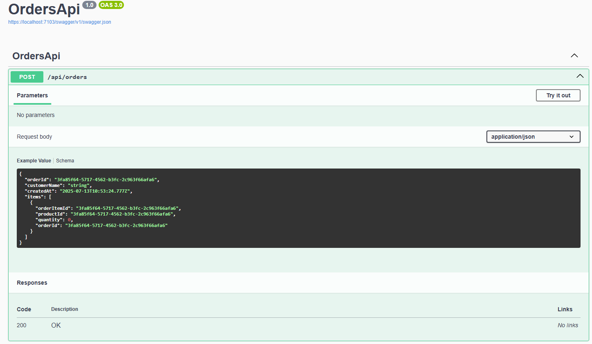
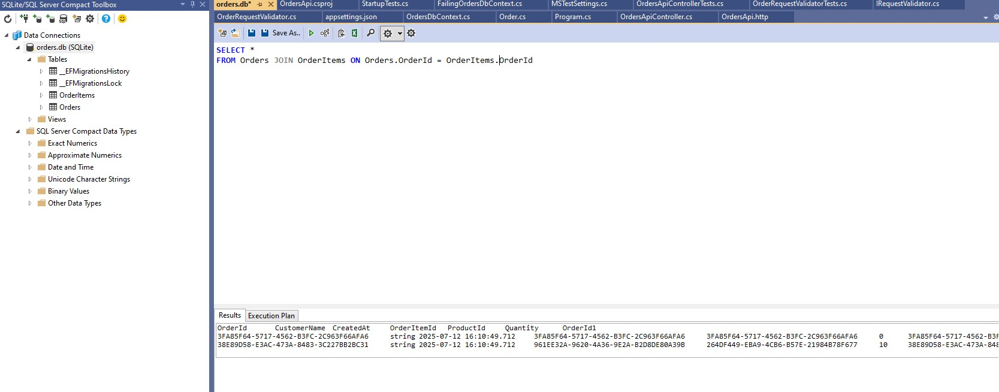
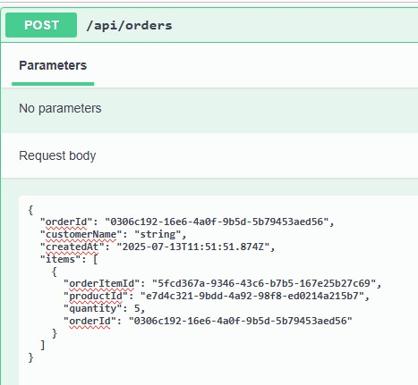
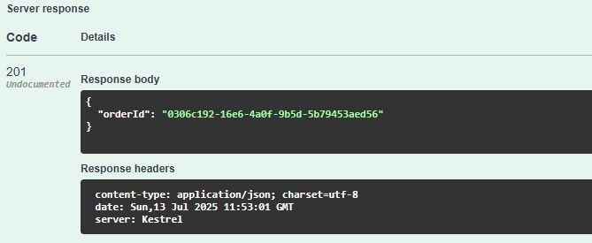
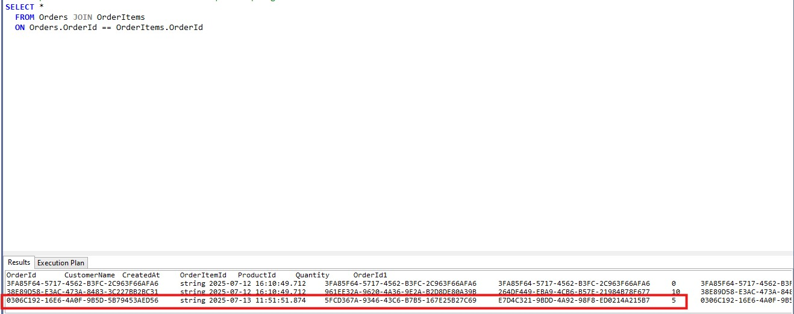
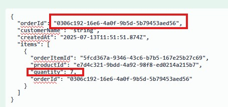
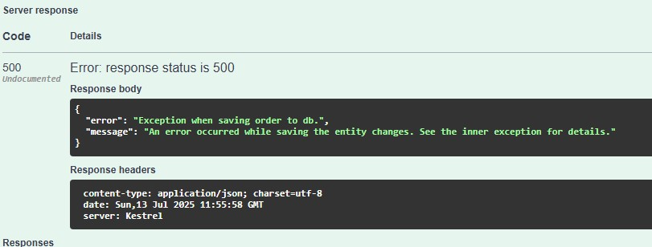
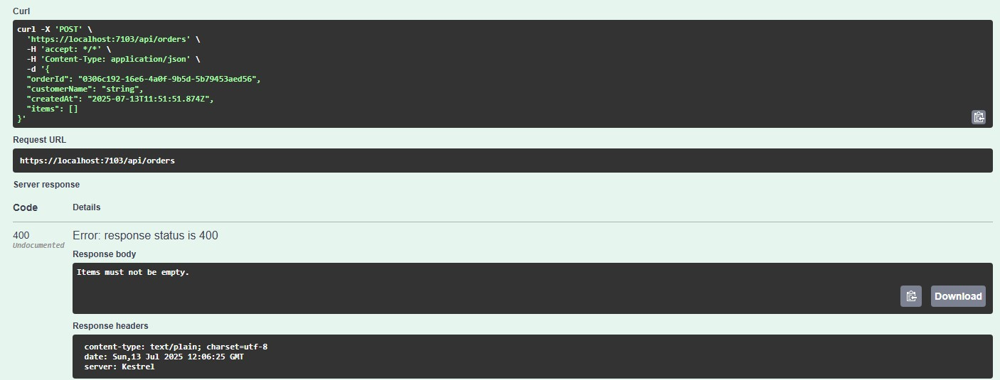
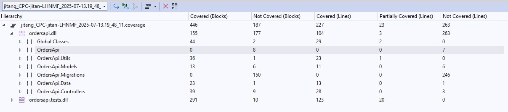

# OrdersAPI

## Overview
This project implements an orders api to create orders and store in to a database (used SQLite for example in this project).
It leverages the EntityFramework.



In Database:


## Setup
This project is based on .Net 8. Ensure you have the SDK installed.

### How to run the app:
In the OrdersApi folder, 

It would output like below:
```
Using launch settings from C:\repo\OrdersAPI\OrdersApi\Properties\launchSettings.json...
Building...
[16:19:16 INF] Now listening on: http://localhost:5047
[16:19:16 INF] Application started. Press Ctrl+C to shut down.
[16:19:16 INF] Hosting environment: Development
[16:19:16 INF] Content root path: C:\repo\OrdersAPI\OrdersApi
```
You may test call http://localhost:5047/api/orders with a valid body in your console or use tools such as postman.
e,g,
``` psws
$uri = "http://localhost:5047/api/orders"
$headers = @{
    "accept" = "*/*"
    "Content-Type" = "application/json"
}
$body = @{
    orderId = "3fa85f64-5717-4562-b3fc-2c963f66afa6"
    customerName = "string"
    createdAt = "2025-07-13T12:26:33.636Z"
    items = @(
        @{
            orderItemId = "3fa85f64-5717-4562-b3fc-2c963f66afa6"
            productId = "3fa85f64-5717-4562-b3fc-2c963f66afa6"
            quantity = 0
            orderId = "3fa85f64-5717-4562-b3fc-2c963f66afa6"
        }
    )
} | ConvertTo-Json -Depth 3

Invoke-RestMethod -Uri $uri -Method Post -Headers $headers -Body $body

```

The project has integreated swagger in dev environment, so you can also goto the swagger page for testing (http://localhost:5047/swagger in this example)


If you are using visual studio, you may run with the run button on the top of the interface. It would open the swagger page directly.

### How to run the tests:
In the OrdersApi.Tests folder, run (in console)
```
dotnet test
```
It would compile the project and output test results in the console window.
Or use the Test Explorer and the 'Run Tests' function in your IDE.

## Api function demo
1. Insert a product with quantity 5.
   


2. The api returns success with 201 and orderid.
   


3. The database contains the order just inserted.
 


4. If try to add an illegal order (repeated order id for example), will return corresponding error response.
   



5. try add order with invalid request body (e.g. empty product list), will return corresponding error response.


And db will not be affected when have error.
   


## Unit Test
This project consists 3 sets of test as of today. The startup test covers the program startup. The Controller tests the api controller and the utils tests the util methods.

Did not cover the migration part.

